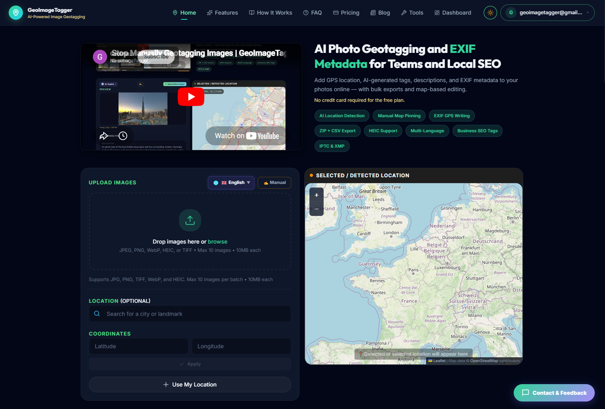
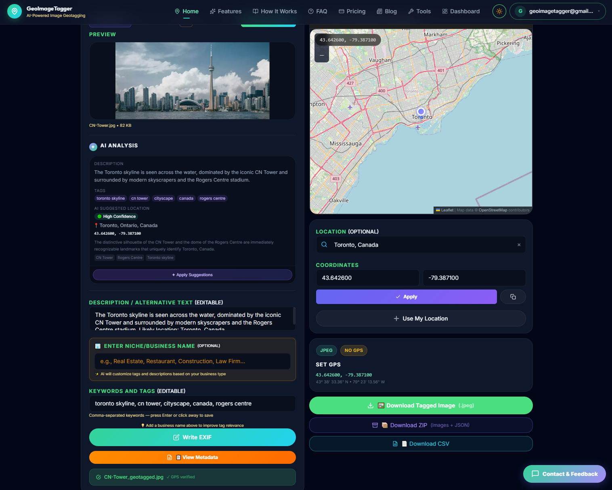
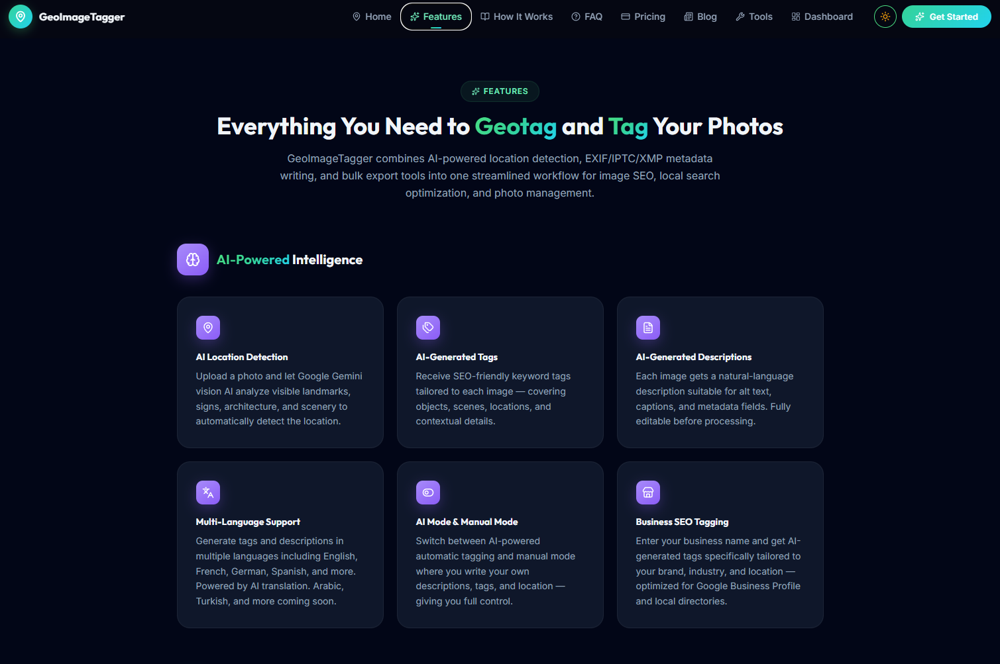
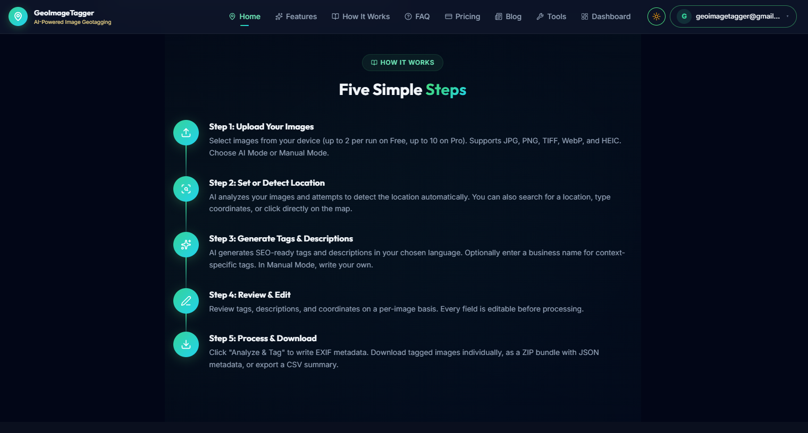

# GeoImageTagger

AI-powered image geotagging and EXIF metadata automation platform.

Website: https://geoimagetagger.com

## Features

- AI image geotagging
- EXIF metadata editing
- GPS coordinate embedding
- SEO metadata generation
- AI image descriptions
- Image metadata viewer
- Image compression tools
- Image conversion tools
- Batch processing workflows
- Cloud-based SaaS platform

## Platform Highlights

GeoImageTagger helps photographers, SEO agencies, field inspection teams, marketers, and businesses automate image metadata workflows using AI-assisted geolocation and EXIF processing.

## Screenshots

### Homepage

### AI Geotagging

### Features

### Application Workflow

### Metadata Tools

### Dashboard Status

## Tech Stack

- Next.js
- TypeScript
- Artificial Intelligence
- Tailwind CSS
- EXIFTool
- Sharp
- Cloud Run

## Live Website

https://geoimagetagger.com

## Social Links

- LinkedIn: https://www.linkedin.com/company/geoimagetagger/
- X/Twitter: https://x.com/GeoImageTagger
- https://www.facebook.com/profile.php?id=61590177459614
- YouTube: https://www.youtube.com/@GeoImageTagger
- Instagram: https://www.instagram.com/geoimagetagger/
- Pinterest: https://www.pinterest.com/geoimagetagger/

---

© GeoImageTagger
